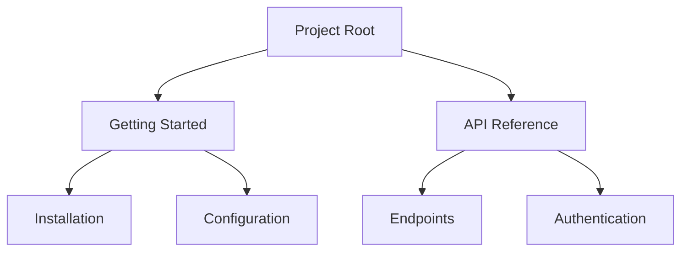

## Overview

Gobind Bakhshi provides powerful tools to streamline your documentation workflow. You create structured content, collaborate seamlessly with teams, track changes over time, and find information quickly. These features ensure your project docs stay organized and up-to-date.

<Columns cols={2}>
  <Card title="Structured Hierarchies" icon="layout" href="#document-structuring">
    Build nested pages and folders effortlessly.
  </Card>
  <Card title="Real-Time Collaboration" icon="users" href="#collaboration">
    Edit documents together in real time.
  </Card>
  <Card title="Version History" icon="git-branch" href="#version-history">
    Revert changes and maintain revision logs.
  </Card>
  <Card title="Advanced Search" icon="search" href="#search-tagging">
    Tag and search your docs efficiently.
  </Card>
</Columns>

## Document Structuring and Hierarchies

Organize your documentation into intuitive hierarchies. You nest pages under folders, create sidebars, and define navigation menus. This keeps large projects manageable.

Use the API to create structured documents:

<CodeGroup tabs="JavaScript,Python">
  ```javascript
  const response = await fetch('https://api.example.com/docs', {
    method: 'POST',
    headers: { 'Authorization': 'Bearer YOUR_API_KEY' },
    body: JSON.stringify({
      title: 'API Reference',
      parentId: 'project-root',
      content: '# Introduction\nStart here.'
    })
  });
  ```
  ```python
  import requests
  response = requests.post('https://api.example.com/docs',
    headers={'Authorization': 'Bearer YOUR_API_KEY'},
    json={
      'title': 'API Reference',
      'parentId': 'project-root',
      'content': '# Introduction\nStart here.'
    }
  )
  ```
</CodeGroup>

Visualize your hierarchy:



<Callout kind="tip">
  Start with a root folder and add up to 5 levels of nesting for optimal navigation.
</Callout>

## Collaboration and Real-Time Editing

Invite team members to edit docs simultaneously. Changes appear instantly, with cursor indicators and conflict resolution.

<Steps>
  <Step title="Invite Collaborators" icon="users">
    Share a link or add emails via the dashboard.
  </Step>
  <Step title="Start Editing" icon="edit-3">
    Open the doc at `https://dashboard.example.com/docs/project-id`.
  </Step>
  <Step title="Resolve Conflicts" icon="alert-triangle">
    Use the merge tool for overlapping edits.
  </Step>
</Steps>

<Tabs>
  <Tab title="WebSocket Connection" icon="wifi">
    Connect for real-time updates:

    ```javascript
    const ws = new WebSocket('wss://api.example.com/docs/YOUR_DOC_ID/realtime');
    ws.onmessage = (event) => {
      const update = JSON.parse(event.data);
      applyDelta(update.delta);
    };
    ```
  </Tab>
  <Tab title="Permissions" icon="shield">
    Set roles: viewer, editor, admin.
  </Tab>
</Tabs>

## Version History and Revisions

Track every change with automatic versioning. You compare diffs, restore previous versions, and branch docs for experiments.

Access history via API:

<ParamField path="docId" param-type="string" required="true">
  Document identifier.
</ParamField>

<ResponseField name="versions" field-type="array" required="true">
  List of revision objects.
</ResponseField>

<ResponseField name="diff" field-type="object">
  Changes between versions.
</ResponseField>

## Search Functionality and Tagging

Tag documents for quick filtering. Full-text search indexes content, titles, and tags across your workspace.

Add tags when creating docs:

```javascript
await fetch('https://api.example.com/docs', {
  method: 'POST',
  body: JSON.stringify({
    title: 'New Guide',
    tags: ['guide', 'api', 'v1']
  })
});
```

<Expandable title="Advanced Search Filters" default-open="false">

| Filter Type | Example | Description |
|-------------|---------|-------------|
| Tag         | `tag:api` | Matches documents with `api` tag |
| Date        | `date:>2024-01-01` | Recent changes |
| Author      | `author:john@example.com` | Specific contributor |

Combine filters: `tag:api date:>2024-01-01`.

</Expandable>

<Callout kind="success">
  Tagging improves discoverability—aim for 3-5 tags per document.
</Callout>