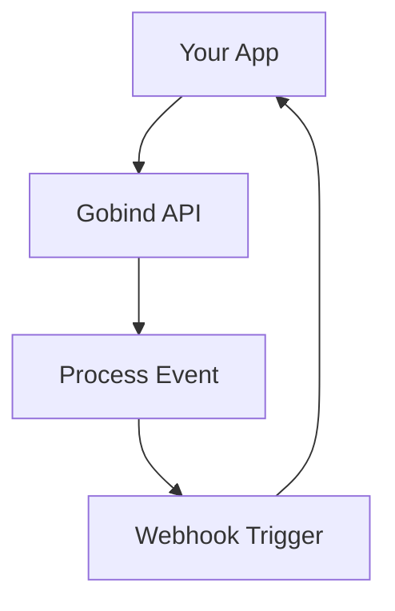

## Overview

Connect Gobind Bakhshi to your favorite tools to automate workflows, receive notifications, and export content seamlessly. You can integrate with third-party apps for collaboration, use the REST API for custom solutions, set up webhooks for real-time updates, and export documentation to various formats.

<Callout kind="info">
  All integrations require a valid API key. Generate one from your account settings at `https://dashboard.example.com/settings/api`.
</Callout>

## Popular Third-Party Integrations

Gobind Bakhshi supports one-click connections to popular services. Start by navigating to the Integrations page in your dashboard.

<Columns cols={3}>
  <Card title="GitHub" icon="github" href="https://dashboard.example.com/integrations/github">
    Sync repositories and automatically generate docs from code.
  </Card>
  <Card title="Slack" icon="message-circle" href="https://dashboard.example.com/integrations/slack">
    Get notifications for doc updates and share previews in channels.
  </Card>
  <Card title="Notion" icon="notion" href="https://dashboard.example.com/integrations/notion">
    Import pages and keep your knowledge base synchronized.
  </Card>
</Columns>

## Custom Integrations via API

Build tailored solutions using the Gobind Bakhshi REST API at `https://api.example.com`. Authenticate requests with your API key in the `Authorization` header.

<ParamField header="Authorization" param-type="string" required="true">
  Bearer `{YOUR_API_KEY}`.
</ParamField>

<ParamField query="projectId" param-type="string" required="true">
  Your project identifier.
</ParamField>

Here is an example to fetch documentation lists:

<CodeGroup tabs="JavaScript,Python">
  ```javascript
  const response = await fetch('https://api.example.com/docs?projectId={YOUR_PROJECT_ID}', {
    headers: {
      'Authorization': `Bearer ${YOUR_API_KEY}`
    }
  });
  const docs = await response.json();
  console.log(docs);
  ```
  ```python
  import requests

  headers = {'Authorization': f'Bearer {YOUR_API_KEY}'}
  params = {'projectId': 'YOUR_PROJECT_ID'}
  response = requests.get('https://api.example.com/docs', headers=headers, params=params)
  docs = response.json()
  print(docs)
  ```
</CodeGroup>

<Response tabs="200">
```json
{
  "docs": [
    {
      "id": "doc_123",
      "title": "Getting Started",
      "updatedAt": "2024-10-15T10:00:00Z"
    }
  ]
}
```
</Response>

## Webhook Configuration

Set up webhooks to receive events like doc updates or new versions. Follow these steps:

<Steps>
  <Step title="Create Webhook" icon="plus">
    Go to `https://dashboard.example.com/settings/webhooks` and click "New Webhook".
  </Step>
  <Step title="Configure URL" icon="link">
    Enter your endpoint, e.g., `https://your-webhook-url.com/gobind`.
  </Step>
  <Step title="Select Events" icon="zap">
    Choose events like `doc.updated` or `project.published`.
  </Step>
  <Step title="Verify and Save" icon="check-circle">
    Gobind Bakhshi sends a verification ping. Respond with `200 OK`.
  </Step>
</Steps>

Handle incoming webhooks securely:

````jsx
<CodeGroup>
  ```javascript
  app.post('/gobind', (req, res) => {
    const event = req.headers['x-gobind-event'];
    const signature = req.headers['x-gobind-signature'];
    
    // Verify signature with your webhook secret
    if (event === 'doc.updated') {
      console.log('Doc updated:', req.body);
    }
    
    res.status(200).send('OK');
  });
  ```
  ```python
  from flask import Flask, request

  app = Flask(__name__)

  @app.route('/gobind', methods=['POST'])
  def webhook():
      event = request.headers.get('X-Gobind-Event')
      signature = request.headers.get('X-Gobind-Signature')
      
      # Verify signature
      if event == 'doc.updated':
          print('Doc updated:', request.json)
      
      return 'OK', 200
  ```
</CodeGroup>
````

## Export Options

Export your documentation to share or archive in different formats. Use the dashboard export tool or API.

<Tabs>
  <Tab title="PDF" icon="file-text">
    Generate printable PDFs with full styling preserved.
    
    ```bash
    curl -H "Authorization: Bearer {YOUR_API_KEY}" \
         "https://api.example.com/export/pdf?docId=doc_123" \
         --output docs.pdf
    ```
  </Tab>
  <Tab title="Markdown" icon="file">
    Export clean Markdown for GitHub or other Markdown editors.
    
    ```bash
    curl -H "Authorization: Bearer {YOUR_API_KEY}" \
         "https://api.example.com/export/md?projectId=YOUR_PROJECT_ID" \
         --output project.md
    ```
  </Tab>
  <Tab title="HTML" icon="code">
    Get static HTML for embedding or hosting.
    
    ```bash
    curl -H "Authorization: Bearer {YOUR_API_KEY}" \
         "https://api.example.com/export/html?docId=doc_123" \
         --output docs.html
    ```
  </Tab>
</Tabs>

<Callout kind="tip">
  Exports are rate-limited to 10 per hour. Upgrade your plan for higher limits.
</Callout>

## Next Steps

<Expandable title="Advanced Integration Flows" default-open="false">

For complex setups, visualize the typical integration flow:



Combine API calls with webhooks for bidirectional sync.

</Expandable>

Explore more in the [API Reference](/api) or set up your first integration today.